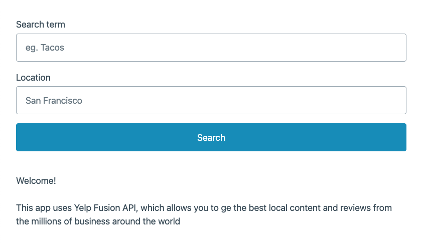

# Yelpy

## Demo link:

Access demo at [https://yelp-flax.vercel.app/](https://yelp-flax.vercel.app)

## Table of Content:

- [About the app](#about-the-app)
- [Technologies used](#technologies-used)
- [Setup](#running-the-app)
- [Status](#status)

## About The App

Yelpy is a mini version of [yelp](https://yelp.com). Powered by Yelp Graphql Api, this app allow users to find the best local content and reviews from the millions of business around the world

## Motivation

In today's landscape of frontend development, there's an abundance of frameworks and libraries for crafting modern web applications. While these tools undoubtedly speed up the development process, many core concepts are abstracted and _hidden_. I believe mastering the fundamentals is key to grow as software engineer

That's why, I've decided to build this project with these goals in mind:

- Mastering the fundamentals of client-side web development
- Minimizing reliance on frameworks and libraries to prioritize a deeper understanding of foundational concepts.
- Adopting a framework-free approach, focusing solely on JavaScript, HTML, and CSS (and latter Typescript).
- Gaining insight into the inner workings of Single Page Applications and frontend frameworks.
- Engaging in deliberate practice to expand my knowledge and expertise in vanilla JavaScript - _css styling is not focus here_

And on a personal note, I'm tired of the recommendation to create a TO-DO app. That's why I choose something a little different and challenging enough

## Technologies used

## Running the app

- `git clone https://github.com/manu-yaff/yelp/tree/master && cd yelp`
- You'll need a local server, you could either use a tool like [live server](https://marketplace.visualstudio.com/items?itemName=ritwickdey.LiveServer) extension or [http-server](https://www.npmjs.com/package/http-server). To start the app use index.html as the entry point for the server

## Status

I also use this project to apply `client-side` concepts that I learn in courses, docs, articles, etc. It's my safe place where I can try out new things and experiment. That's why I update it from time to time

I'll be creating several versions of this project for fun and to practice. In each corresponding branch I'll be documenting my learnings and approach taken

Branches for each version

- Vanilla JS -> [pure-vanilla-js](https://github.com/manu-yaff/yelp/tree/version/pure-vanilla-js)
- Typescript -> [typescript](https://github.com/manu-yaff/yelp/tree/version/typescript)
- React (TBD)
