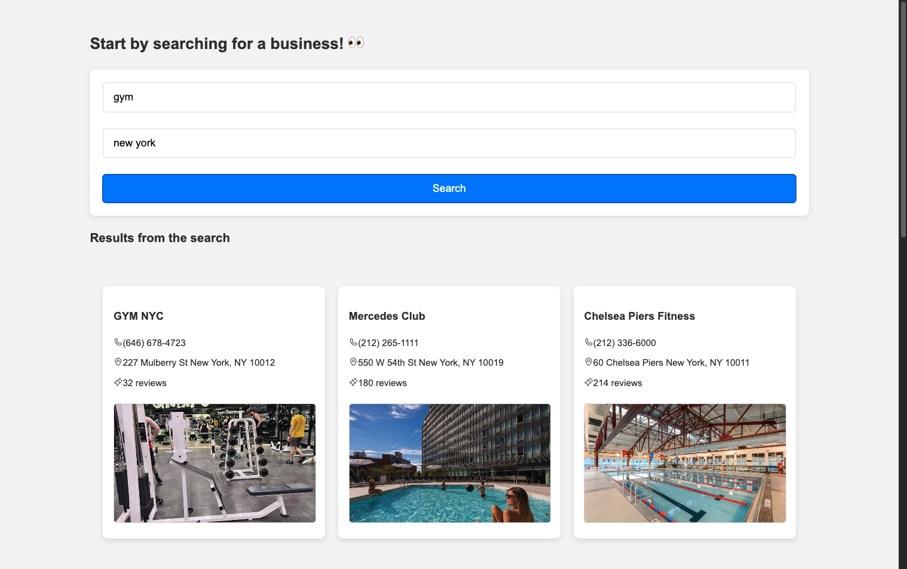

# Yelpy

## 📌 Project Description

Yelpy is a simple business search application that utilizes the Yelp API to fetch business information based on a search term and location.



### Features:

- Search for businesses worldwide.
- View up to 10 top search results for any given query.
- Access detailed information about a selected business.

🚨 **Note:** This project primarily focuses on experimenting with **clean architecture and testing concepts**. Styling and React best practices were not the main priority.

## 🛠️ Tech

- TypeScript
- React
- Vitest

## 📦 Dependencies

- Node.js v20.11.0

## Scripts

Before running the project, install the required dependencies:

```sh
npm install
```

Running the project

```sh
npm run dev
```

Running the tests

```sh
npm run test
```
